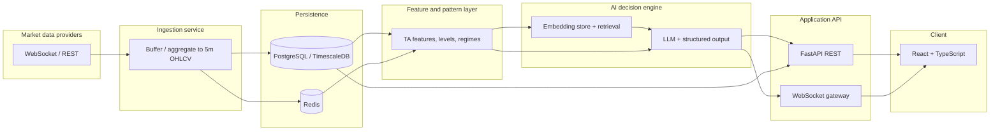

# QuantEdge AI — System Architecture (V1)

**Product:** QuantEdge AI – Real-Time Futures Insights Engine  
**Phase 1 deliverable:** Logical architecture, technology choices, and environment strategy.

## Logical architecture

Data flows left-to-right: ingestion persists time-series data; the feature layer derives deterministic context; the AI layer augments with RAG + LLM; the API exposes HTTP and WebSockets to the React client.

### Service responsibilities (V1)

| Component | Responsibility |
|-----------|----------------|
| **Ingestion** | Connect to provider; reconnect/backoff; aggregate to 5m OHLCV; write bars; publish internal events. |
| **Time-series store** | Durable OHLCV history; query by symbol and time range for charts and backtests. |
| **Redis** | Hot cache of latest bars, session state, optional pub/sub between workers. |
| **Feature layer** | Deterministic indicators, support/resistance, volatility regime; outputs **structured** objects (see contracts). |
| **RAG** | Chunked methodology KB in vector store; retrieve top-k conditioned on market snapshot metadata. |
| **LLM service** | Prompt with snapshot + retrieved chunks; return **schema-valid** insight JSON + short narrative. |
| **API** | REST for health, history, on-demand insight; WebSocket for live bars and insight updates. |
| **Frontend** | Charts, overlays from structured fields, narrative panel; reconnecting WebSocket client. |

## Technology choices (V1 — locked)

| Area | Choice |
|------|--------|
| Backend runtime | Python 3.11+ |
| API framework | FastAPI |
| Real-time | `websockets` / Starlette WebSocket |
| ORM / DB | SQLAlchemy 2.x + Alembic; PostgreSQL 15+ |
| Time-series (optional) | TimescaleDB extension on PostgreSQL |
| Cache | Redis 7+ |
| Data processing | pandas, numpy |
| Vector store | Chroma (local/dev); Pinecone or managed alternative for production if needed |
| LLM | OpenAI or Anthropic API (V1 single provider); structured outputs / JSON mode |
| RAG orchestration | LangChain-style or lightweight custom retrieval |
| Frontend | React 18, TypeScript, Vite |
| Charts | Recharts and/or Plotly.js for React |
| Real-time client | Native WebSocket or Socket.IO client (match server) |
| Containers | Docker, Docker Compose |
| Logging | structlog + standard logging |
| Metrics | Prometheus-compatible counters/histograms (optional in V1) |

## Environments

| Environment | Purpose | Notes |
|-------------|---------|--------|
| **dev** | Local Docker Compose; hot reload; test API keys | May use Chroma locally; small symbol set |
| **staging** | Pre-production; integration tests | Mirrors prod topology; separate DB and secrets |
| **prod** | Customer or demo deployment | TLS, secrets vault, backups, rate limits |

Secrets (provider keys, LLM keys, DB URLs) are **never** committed; use `.env` locally and platform secret stores in staging/prod.

## Related documents

- [API contract draft](api-contract.md) — REST and WebSocket message shapes.
- [JSON Schemas](../contracts/README.md) — shared data contracts for bars, features, and insights.
